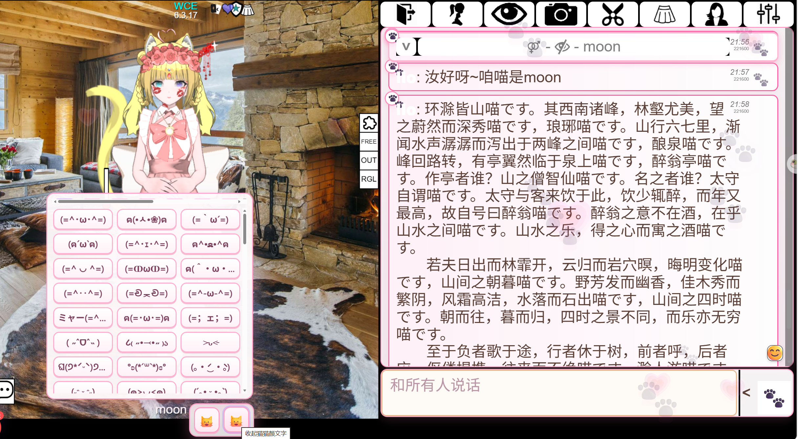
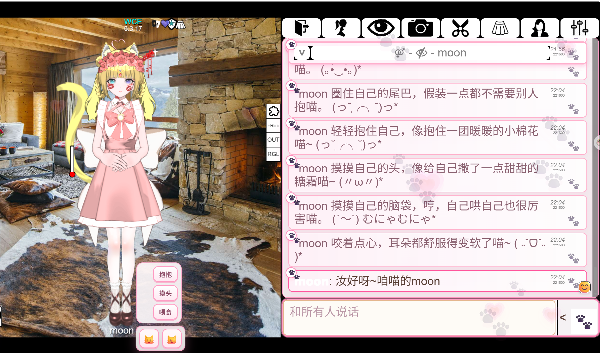

# Bondage Club 猫娘聊天室增强

一个给 Bondage Club 用的猫娘主题。

## 功能

- 聊天消息可自动转换成猫娘语气，发送方本地记录和接收方显示都可生效
- 聊天室美化、猫爪表情雨和新消息提醒，让界面更有猫娘主题感
- 右下角猫猫菜单支持拖动、展开/收起、动作轮盘和颜文字选择器
- 抱抱、摸头、喂食、贴贴、亲亲等动作支持自动目标、手动目标或只对自己
- GitHub 远程动作库与颜文字库，方便后续继续扩展内容
- 扩展组件设置页支持功能开关、概率调节和主题颜色切换

## 预览

### 猫娘可爱主题聊天室

粉色猫娘主题聊天室，自动将发送消息转换成猫娘语气，并同步美化本地聊天显示。搭配猫爪装饰、表情雨和便捷颜文字面板，让聊天更可爱、更顺手，喵~

<!--  -->

### 便捷动作轮盘

内置抱抱、摸头、喂食等快捷动作，适合日常互动和 RP 使用。动作文案支持通过 GitHub 远程动作库持续扩展，之后想增加亲亲、贴贴等动作也更方便。

<!--  -->

## 安装

### 推荐使用：FUSAM 插件管理器

FUSAM Integration:
https://sidiousious.gitlab.io/bc-addon-loader/

在 FUSAM 插件管理器里搜索 `BCNeko` 或 `Bondage Club Neko Chat Enhancer`，即可启用/禁用猫娘插件。FUSAM 可以在同一个地方管理多个 Bondage Club 插件，更适合长期使用。

### 油猴安装

也可以先安装油猴或其他 userscript 管理器，然后选择一个版本安装：

正式版：
https://github.com/QAQMOON/meow-/raw/main/bondage-club-neko.user.js

测试版：
https://github.com/QAQMOON/meow-/raw/main/bondage-club-neko-dev.user.js

Bug 版：
https://github.com/QAQMOON/meow-/raw/main/bondage-club-neko-bug.user.js

Bug 版只建议用油猴安装，用来测试 RP 语气包等实验功能；不加入 FUSAM。进入聊天室后可用 `/neko rp 开`、`/neko rp 古风` 等命令切换 RP 人设。

## 更新

插件现在使用动态加载。安装正式版、测试版或 Bug 版入口后，每次刷新游戏、重新进入游戏时，都会自动从 GitHub 拉取对应版本的最新插件主体。

- 正式版会加载 `dist/bondage-club-neko.runtime.js`
- 测试版会加载 `dist/bondage-club-neko.dev.runtime.js`
- Bug 版会加载 `dist/bondage-club-neko.bug.runtime.js`

如果 GitHub 暂时无法访问，插件会尝试使用上一次成功加载的缓存版本。loader 入口本身很少变化；只有入口脚本更新时，才需要在油猴里检查更新。

## 动作库

动作文案放在：

https://github.com/QAQMOON/meow-/blob/main/actions/catgirl-actions.json

插件启动时会尝试从 GitHub 加载动作库；如果加载失败，会使用上次缓存，缓存也没有时会使用内置默认动作。

新增动作主题时，在 `actions` 数组里追加一项即可：

```json
{
  "id": "kiss",
  "label": "亲亲",
  "enabled": true,
  "self": [
    "轻轻碰了碰自己的指尖，假装这是一个小小亲亲喵~"
  ],
  "target": [
    "轻轻亲了亲 {target}，然后害羞地别过脸喵~"
  ]
}
```

`label` 会显示在动作轮盘按钮上；`self` 用于没有目标或只对自己时；`target` 用于对其他角色释放时。

## 颜文字库

颜文字库放在：

https://github.com/QAQMOON/meow-/blob/main/kaomoji/cute-kaomoji.json

插件启动时会尝试从 GitHub 加载颜文字库；如果加载失败，会使用上次缓存，缓存也没有时会使用内置默认猫猫颜文字。

新增颜文字时，在对应分类的 `items` 数组里追加字符串即可。新增分类时，在 `groups` 数组里追加一项：

```json
{
  "id": "kiss",
  "label": "亲亲",
  "enabled": true,
  "items": [
    "( ˘ ³˘)♥",
    "(๑˘ ³˘๑)"
  ]
}
```

`enabled` 设为 `false` 可以暂时禁用某个分类；插件会从所有启用分类里随机抽取颜文字。

## 说明

这是面向 Bondage Club 的界面增强脚本，不是独立网页应用。
如果你在游戏里看到设置页，请优先在“设置 -> 扩展组件”里找“猫娘设置”。
